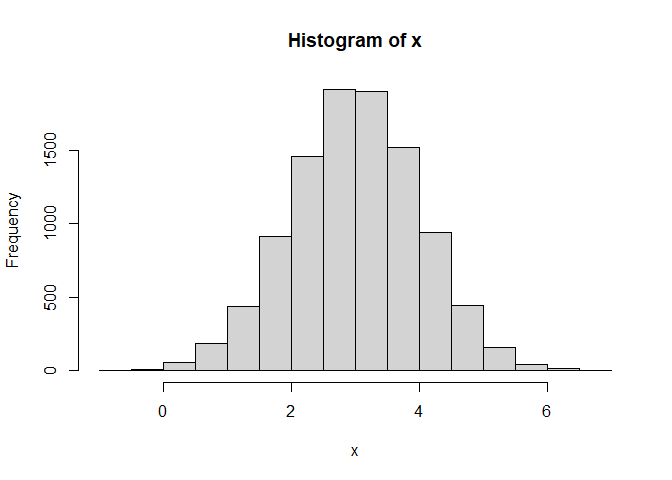
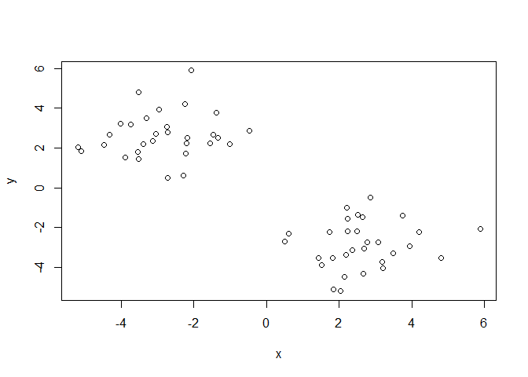
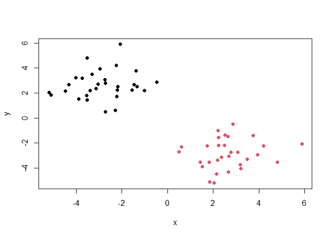
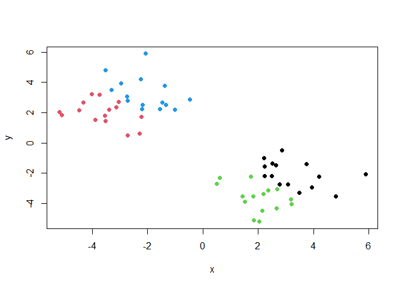
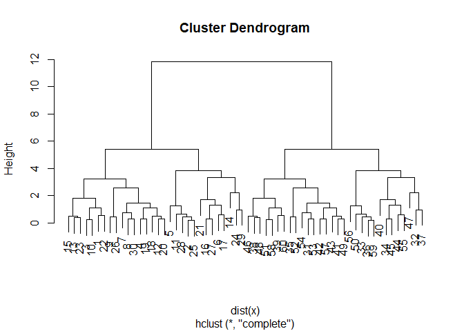
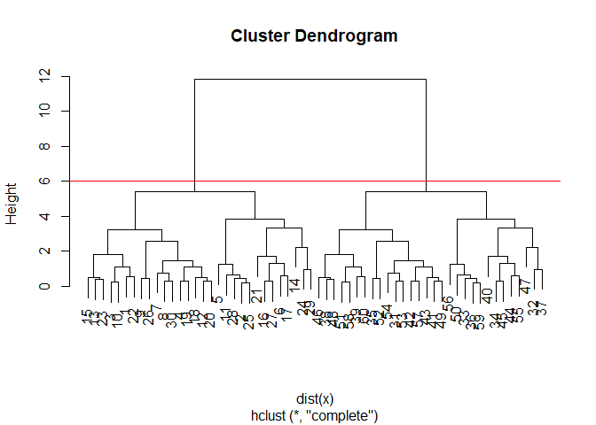
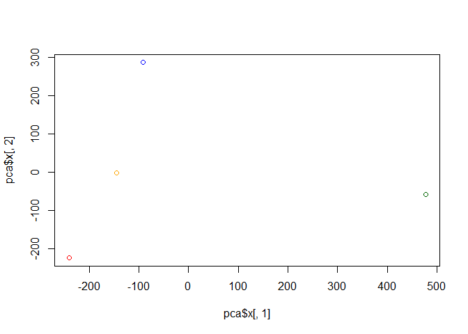
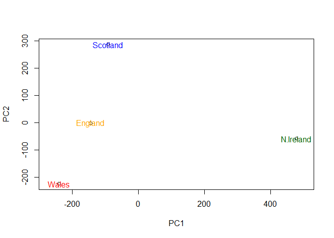

# Class 07 Machine learning 1
Lance

\#Clustering We will start today’s lab with clustering methods, in
particular so called K-means. The main function of this in R is
`kmeans()`

First will try on made up data to see what answer should be. It
generates random numbers centered around a particular value

``` r
x <- rnorm(10000, mean = 3)
hist(x)
```



``` r
#Generate some example data for clustering
#60 points
tmp <- c(rnorm(30, mean = 3), rnorm (30, -3))
x <- cbind(x=tmp, y=rev(tmp))
#note: rev function reverses the order
plot(x)
```



\#note if keep pressing play will keep generating different random
numbers \# we can pass this to the base R `plot()` function for a quick
plot

``` r
#Use the kmeans() function setting k to 2 and nstart=20 (#nstart makes it run the number of times and picks best answer)
kmeans(x, centers = 2, nstart = 20 )
```

    K-means clustering with 2 clusters of sizes 30, 30

    Cluster means:
              x         y
    1  2.636921 -2.857783
    2 -2.857783  2.636921

    Clustering vector:
     [1] 1 1 1 1 1 1 1 1 1 1 1 1 1 1 1 1 1 1 1 1 1 1 1 1 1 1 1 1 1 1 2 2 2 2 2 2 2 2
    [39] 2 2 2 2 2 2 2 2 2 2 2 2 2 2 2 2 2 2 2 2 2 2

    Within cluster sum of squares by cluster:
    [1] 77.33257 77.33257
     (between_SS / total_SS =  85.4 %)

    Available components:

    [1] "cluster"      "centers"      "totss"        "withinss"     "tot.withinss"
    [6] "betweenss"    "size"         "iter"         "ifault"      

``` r
k <- kmeans(x, centers = 2, nstart = 20 )
#centers is how many clusters there are.

#Inspect/print the results
plot(x, col=k$cluster, pch=16)
```



``` r
#color as assigned to k$cluster which differentiated the points by color
```

Clustering vector is telling which cluster each is assigned to.
Available components are what are available in the k list (see in upper
right)

> Q: How many points are in each cluster?

``` r
k$size
```

    [1] 30 30

A:30

> Q. What ‘component’ of your result object details - cluster size?

A: K\$size

> cluster assignment/membership?

A: k\$cluster

``` r
k$cluster
```

     [1] 2 2 2 2 2 2 2 2 2 2 2 2 2 2 2 2 2 2 2 2 2 2 2 2 2 2 2 2 2 2 1 1 1 1 1 1 1 1
    [39] 1 1 1 1 1 1 1 1 1 1 1 1 1 1 1 1 1 1 1 1 1 1

> Cluster centers? (K\$centers)

A: k\$centers

``` r
k$centers
```

              x         y
    1 -2.857783  2.636921
    2  2.636921 -2.857783

A: 2

> Cluster the data again with kmeans()into 4 groups and plot the results

``` r
k4 <- kmeans(x, centers = 4, nstart = 20 )
plot(x, col=k4$cluster, pch=16)
```



K-means is very popular mostly because it is fast and relatively
straightforward to run and understand. It has a big limitation in that
you need to tell it how many groups (k, or, centers) you want. This can
be determined from a scree plot (Number of clusters vs. total within SS)
but it is a lot of work. Heirarchical clustering is an easier way to
find this.

\#Heirarchical clustering hclust() uses heirarchical clustering (from
bottom to top, or top to bottom). You have to pass it in a “distance
matrix”

You can generate a distance matrix with the dist() function.

``` r
# First we need to calculate point (dis)similarity as the Euclidean distance between observations. In R, the dist() function is used to compute the distance or dissimilarity between pairs of observations (data points) in a dataset. The result of the dist() function is a distance matrix, which provides a pairwise comparison of distances between observations.
dist_matrix <- dist(x)
#note the matrix can be viewed using the function View( as.matrix(dist_matrix) )

#note: dim(x) will show the dimensions of the x data set (60 rows, 2 columns).  If you input dim( as.matrix(dist_matrix) ) the result will be 60x60 since it is comparing all 60 points to eachother in a matrix.

# The hclust() function returns a hierarchical clustering model
hc <- hclust(dist(x))
# the print method is not so useful here
hc
```


    Call:
    hclust(d = dist(x))

    Cluster method   : complete 
    Distance         : euclidean 
    Number of objects: 60 

``` r
plot(hc)
```



\#note first branch has values 1-30, and second branch has values 31-60

To find the clusters (cluster membership vector) from a `hclust()`
result we can “cut” the tree at a certain height that we like. For this
we use `cutree()`

``` r
plot(hc)
abline(h=8, col="red")
```


``` r
cutree(hc, h=6) # Cut by height h
```

     [1] 1 1 1 1 1 1 1 1 1 1 1 1 1 1 1 1 1 1 1 1 1 1 1 1 1 1 1 1 1 1 2 2 2 2 2 2 2 2
    [39] 2 2 2 2 2 2 2 2 2 2 2 2 2 2 2 2 2 2 2 2 2 2

``` r
plot(hc)
abline(h=6, col="red")
```



``` r
cutree(hc, k=2 ) # Cut into k grps
```

     [1] 1 1 1 1 1 1 1 1 1 1 1 1 1 1 1 1 1 1 1 1 1 1 1 1 1 1 1 1 1 1 2 2 2 2 2 2 2 2
    [39] 2 2 2 2 2 2 2 2 2 2 2 2 2 2 2 2 2 2 2 2 2 2

\#Principal Component analysis

\#PCA of UK food data

``` r
url <- "https://tinyurl.com/UK-foods"
x <- read.csv(url)
x
```

                         X England Wales Scotland N.Ireland
    1               Cheese     105   103      103        66
    2        Carcass_meat      245   227      242       267
    3          Other_meat      685   803      750       586
    4                 Fish     147   160      122        93
    5       Fats_and_oils      193   235      184       209
    6               Sugars     156   175      147       139
    7      Fresh_potatoes      720   874      566      1033
    8           Fresh_Veg      253   265      171       143
    9           Other_Veg      488   570      418       355
    10 Processed_potatoes      198   203      220       187
    11      Processed_Veg      360   365      337       334
    12        Fresh_fruit     1102  1137      957       674
    13            Cereals     1472  1582     1462      1494
    14           Beverages      57    73       53        47
    15        Soft_drinks     1374  1256     1572      1506
    16   Alcoholic_drinks      375   475      458       135
    17      Confectionery       54    64       62        41

> Q1. How many rows and columns are in your new data frame named x? What
> R functions could you use to answer this questions?

``` r
nrow(x)
```

    [1] 17

``` r
ncol(x)
```

    [1] 5

Adjusting the column names so that there are only 4:

``` r
# Note how the minus indexing works
rownames(x) <- x[,1]
x <- x[,-1]
head(x)
```

                   England Wales Scotland N.Ireland
    Cheese             105   103      103        66
    Carcass_meat       245   227      242       267
    Other_meat         685   803      750       586
    Fish               147   160      122        93
    Fats_and_oils      193   235      184       209
    Sugars             156   175      147       139

``` r
dim(x)
```

    [1] 17  4

Note: This method could be dangerous because it removes the first
column. An alternative approach to setting the correct row-names in this
case would be to read the data filie again and this time **set the
row.names argument of read.csv() to be the first column** (i.e. use
argument setting row.names=1), see below:

``` r
x <- read.csv(url, row.names=1)
head(x)
```

                   England Wales Scotland N.Ireland
    Cheese             105   103      103        66
    Carcass_meat       245   227      242       267
    Other_meat         685   803      750       586
    Fish               147   160      122        93
    Fats_and_oils      193   235      184       209
    Sugars             156   175      147       139

> Q2. Which approach to solving the ‘row-names problem’ mentioned above
> do you prefer and why? Is one approach more robust than another under
> certain circumstances? A: The second approach is more robust because
> it prevents deletion of rows in case the command is ran multiple
> times.

A cursory glance over the numbers in this table does not reveal much of
anything. Indeed in general it is difficult to extract meaning in regard
to major differences and trends from any given array of numbers.
Generating regular bar-plots and various pairwise plots does not help
too much either:

``` r
barplot(as.matrix(x), beside=T, col=rainbow(nrow(x)))
```


> Q3: Changing what optional argument in the above barplot() function
> results in the following plot? A: The beside argument. If FALSE, the
> columns of height are portrayed as stacked bars. This value defaults
> to FALSE so if not set then will automatically make a stacked barplot.

``` r
barplot(as.matrix(x), beside=F, col=rainbow(nrow(x)))
```


A pairs plot can be useful if we don’t have too many dimensions…

``` r
pairs(x, col=rainbow(10), pch=16)
```


> Q5: Generating all pairwise plots may help somewhat. Can you make
> sense of the following code and resulting figure? What does it mean if
> a given point lies on the diagonal for a given plot?

A: The plots represent a comparison between the two countries where they
cross on the x/y axis. If the slope = 1, that means the two countries
are 100% correlated. For example one country eats the same amount of
potatoes as the other country.

> Q6. What is the main differences between N. Ireland and the other
> countries of the UK in terms of this data-set? A: The blue, green,
> cyan, and orange dots

\##Principal Component Analysis (PCA) PCA can help us to make sense of
these types of datasets. Let’s see how it works.

The main function in “base” R is called `pcromp()` prcomp() expects the
observations to be rows and the variables to be columns, so first we
want to transpose the rows and columns of the dataset (x) so the columns
are the food types and the rows are the countries.

``` r
#showing the heading of the transposed x dataset
head(t(x))
```

              Cheese Carcass_meat  Other_meat  Fish Fats_and_oils  Sugars
    England      105           245         685  147            193    156
    Wales        103           227         803  160            235    175
    Scotland     103           242         750  122            184    147
    N.Ireland     66           267         586   93            209    139
              Fresh_potatoes  Fresh_Veg  Other_Veg  Processed_potatoes 
    England               720        253        488                 198
    Wales                 874        265        570                 203
    Scotland              566        171        418                 220
    N.Ireland            1033        143        355                 187
              Processed_Veg  Fresh_fruit  Cereals  Beverages Soft_drinks 
    England              360         1102     1472        57         1374
    Wales                365         1137     1582        73         1256
    Scotland             337          957     1462        53         1572
    N.Ireland            334          674     1494        47         1506
              Alcoholic_drinks  Confectionery 
    England                 375             54
    Wales                   475             64
    Scotland                458             62
    N.Ireland               135             41

Then we can assign “pca” to be a prcomp function of the transposition:

``` r
pca <- prcomp(t(x))
summary(pca)
```

    Importance of components:
                                PC1      PC2      PC3       PC4
    Standard deviation     324.1502 212.7478 73.87622 3.176e-14
    Proportion of Variance   0.6744   0.2905  0.03503 0.000e+00
    Cumulative Proportion    0.6744   0.9650  1.00000 1.000e+00

``` r
#can use View(pca) and will see values.  one we are interested in is x
pca$x
```

                     PC1         PC2        PC3           PC4
    England   -144.99315   -2.532999 105.768945 -4.894696e-14
    Wales     -240.52915 -224.646925 -56.475555  5.700024e-13
    Scotland   -91.86934  286.081786 -44.415495 -7.460785e-13
    N.Ireland  477.39164  -58.901862  -4.877895  2.321303e-13

> Q7. Complete the code below to generate a plot of PC1 vs PC2. The
> second line adds text labels over the data points.

``` r
# Plot PC1 vs PC2
plot(pca$x[,1], pca$x[,2], xlab="PC1", ylab="PC2", xlim=c(-270,500))
text(pca$x[,1], pca$x[,2], colnames(x))
```


Can also plot pca\$x PC1 vs Pc2 by with color added to each point to
differentiate the countries.

``` r
plot(pca$x[,1], pca$x[,2], col=c("orange", "red", "blue", "darkgreen", pch=16))
```



> Q8. Customize your plot so that the colors of the country names match
> the colors in our UK and Ireland map and table at start of this
> document.

``` r
plot(pca$x[,1], pca$x[,2], xlab="PC1", ylab="PC2", xlim=c(-270,500))
text(pca$x[,1], pca$x[,2], colnames(x), col=c("orange", "red", "blue", "darkgreen"))
```



The “loadings” tell us how much the original variables (in our case the
foods) contribute to the new variables i.e. the PCs

``` r
## Lets focus on PC1 as it accounts for > 90% of variance 
par(mar=c(10, 3, 0.35, 0))
barplot( pca$rotation[,1], las=2 )
```


``` r
#note: "las" parameter stands for "labeling axis style." It is used to specify the orientation or style of the labels along the axis of a bar plot. 
```

> Q9: Generate a similar ‘loadings plot’ for PC2. What two food groups
> feature prominantely and what does PC2 maninly tell us about?

``` r
par(mar=c(10, 3, 0.35, 0))
barplot( pca$rotation[,2], las=2 )
```


A: Fresh potatoes and soft drinks are the main drivers of the second
PCA. Fresh potatoes pushes Wales down the chart while soft drinks pushes
Scotland upwards on the PCA2 axis.

**Stop after bar chart in “digging deeper” section** Render first in
html to see if works then render to pdf by changing format at the top to
pdf.
