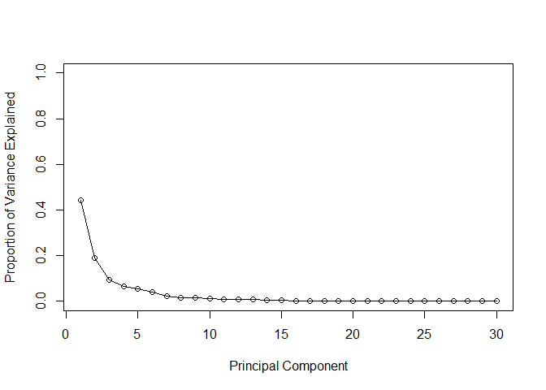

# Class08_Mini_project

Project from
https://bioboot.github.io/bimm143_F23/class-material/wk7_miniproject.html

First to retrieve the data from the .csv file provided. First need to
download it to folder that we are working from or else R won’t see it.

``` r
wisc.df <-read.csv("WisconsinCancer.csv")

# Save your input data file into your Project directory
fna.data <- "WisconsinCancer.csv"

# Complete the following code to input the data and store as wisc.df
#This sets the first column to be the name of the rows:
wisc.df <- read.csv(fna.data, row.names=1)
```

We want to remove the first column with the patient IDs (this is done by
making it the row.name) We want to exclude the diagnosis column to see
if we can reproduce the reults that were found. To make sure we don’t
accidentally include this in our analysis, lets create a new data.frame
that omits this first column:

``` r
# We can use -1 here to remove the first column
wisc.data <- wisc.df[,-1]
```

Finally, setup a separate new vector called diagnosis that contains the
data from the diagnosis column of the original dataset. We will store
this as a factor (useful for plotting) and use this later to check our
results.

``` r
# Create diagnosis vector for later 
diagnosis <- as.factor(wisc.df$diagnosis) 
```

> Q1 How many observations are in this dataset? can use nrow or look at
> the matrix

Q2. How many of the observations have a malignant diagnosis?

``` r
table(wisc.df$diagnosis)
```


      B   M 
    357 212 

``` r
#This tells us how many Bs and Ms
```

``` r
#could also
sum(wisc.df$diagnosis == "M")
```

    [1] 212

> Q3. How many variables/features in the data are suffixed with \_mean?

``` r
#Can use colnames to get the column names.  grep1 allows a search for string within a dataset.  These can then be summed.

sum(grepl("_mean", colnames(wisc.df)) == "TRUE")
```

    [1] 10

Next need to scale the data since they may use different units of
measurement. Check the mean and standard deviation of the features
(i.e. columns) of the wisc.data to determine if the data should be
scaled. Use the colMeans() and apply() functions like you’ve done
before.

``` r
# Check column means and standard deviations
colMeans(wisc.data)
```

                radius_mean            texture_mean          perimeter_mean 
               1.412729e+01            1.928965e+01            9.196903e+01 
                  area_mean         smoothness_mean        compactness_mean 
               6.548891e+02            9.636028e-02            1.043410e-01 
             concavity_mean     concave.points_mean           symmetry_mean 
               8.879932e-02            4.891915e-02            1.811619e-01 
     fractal_dimension_mean               radius_se              texture_se 
               6.279761e-02            4.051721e-01            1.216853e+00 
               perimeter_se                 area_se           smoothness_se 
               2.866059e+00            4.033708e+01            7.040979e-03 
             compactness_se            concavity_se       concave.points_se 
               2.547814e-02            3.189372e-02            1.179614e-02 
                symmetry_se    fractal_dimension_se            radius_worst 
               2.054230e-02            3.794904e-03            1.626919e+01 
              texture_worst         perimeter_worst              area_worst 
               2.567722e+01            1.072612e+02            8.805831e+02 
           smoothness_worst       compactness_worst         concavity_worst 
               1.323686e-01            2.542650e-01            2.721885e-01 
       concave.points_worst          symmetry_worst fractal_dimension_worst 
               1.146062e-01            2.900756e-01            8.394582e-02 

``` r
apply(wisc.data,2,sd)
```

                radius_mean            texture_mean          perimeter_mean 
               3.524049e+00            4.301036e+00            2.429898e+01 
                  area_mean         smoothness_mean        compactness_mean 
               3.519141e+02            1.406413e-02            5.281276e-02 
             concavity_mean     concave.points_mean           symmetry_mean 
               7.971981e-02            3.880284e-02            2.741428e-02 
     fractal_dimension_mean               radius_se              texture_se 
               7.060363e-03            2.773127e-01            5.516484e-01 
               perimeter_se                 area_se           smoothness_se 
               2.021855e+00            4.549101e+01            3.002518e-03 
             compactness_se            concavity_se       concave.points_se 
               1.790818e-02            3.018606e-02            6.170285e-03 
                symmetry_se    fractal_dimension_se            radius_worst 
               8.266372e-03            2.646071e-03            4.833242e+00 
              texture_worst         perimeter_worst              area_worst 
               6.146258e+00            3.360254e+01            5.693570e+02 
           smoothness_worst       compactness_worst         concavity_worst 
               2.283243e-02            1.573365e-01            2.086243e-01 
       concave.points_worst          symmetry_worst fractal_dimension_worst 
               6.573234e-02            6.186747e-02            1.806127e-02 

Execute PCA with the prcomp() function on the wisc.data, scaling if
appropriate, and assign the output model to wisc.pr.

``` r
# Perform PCA on wisc.data by completing the following code
wisc.pr <- prcomp(wisc.data, scale=TRUE)
summary(wisc.pr)
```

    Importance of components:
                              PC1    PC2     PC3     PC4     PC5     PC6     PC7
    Standard deviation     3.6444 2.3857 1.67867 1.40735 1.28403 1.09880 0.82172
    Proportion of Variance 0.4427 0.1897 0.09393 0.06602 0.05496 0.04025 0.02251
    Cumulative Proportion  0.4427 0.6324 0.72636 0.79239 0.84734 0.88759 0.91010
                               PC8    PC9    PC10   PC11    PC12    PC13    PC14
    Standard deviation     0.69037 0.6457 0.59219 0.5421 0.51104 0.49128 0.39624
    Proportion of Variance 0.01589 0.0139 0.01169 0.0098 0.00871 0.00805 0.00523
    Cumulative Proportion  0.92598 0.9399 0.95157 0.9614 0.97007 0.97812 0.98335
                              PC15    PC16    PC17    PC18    PC19    PC20   PC21
    Standard deviation     0.30681 0.28260 0.24372 0.22939 0.22244 0.17652 0.1731
    Proportion of Variance 0.00314 0.00266 0.00198 0.00175 0.00165 0.00104 0.0010
    Cumulative Proportion  0.98649 0.98915 0.99113 0.99288 0.99453 0.99557 0.9966
                              PC22    PC23   PC24    PC25    PC26    PC27    PC28
    Standard deviation     0.16565 0.15602 0.1344 0.12442 0.09043 0.08307 0.03987
    Proportion of Variance 0.00091 0.00081 0.0006 0.00052 0.00027 0.00023 0.00005
    Cumulative Proportion  0.99749 0.99830 0.9989 0.99942 0.99969 0.99992 0.99997
                              PC29    PC30
    Standard deviation     0.02736 0.01153
    Proportion of Variance 0.00002 0.00000
    Cumulative Proportion  1.00000 1.00000

> Q4. From your results, what proportion of the original variance is
> captured by the first principal components (PC1)? A: 44%

> Q5. How many principal components (PCs) are required to describe at
> least 70% of the original variance in the data? A: 3

> Q6. How many principal components (PCs) are required to describe at
> least 90% of the original variance in the data? A: 7

\##Interpreting PCA results Now you will use some visualizations to
better understand your PCA model. A common visualization for PCA results
is the so-called biplot.

However, you will often run into some common challenges with using
biplots on real-world data containing a non-trivial number of
observations and variables. Here we will need to look at some
alternative visualizations. You are encouraged to experiment with
additional visualizations before moving on to the next section

Create a biplot of the wisc.pr using the biplot() function.

``` r
biplot(wisc.pr)
```


> Q7. What stands out to you about this plot? Is it easy or difficult to
> understand? Why? A: It is not easy to understand because the data is
> too condensed and the points are represented by the patient IDs.

``` r
plot(wisc.pr$x[,1], wisc.pr$x[,2], col=diagnosis, pch=4, xlab = "PC1", ylab = "PC2")
```


> Q8. Generate a similar plot for principal components 1 and 3. What do
> you notice about these plots?

``` r
# Repeat for components 1 and 3
plot(wisc.pr$x[,1], wisc.pr$x[,3], col=diagnosis, pch=4, xlab = "PC1", ylab = "PC3")
```


A: The clusters of PCA1 vs PCA2 have better separation than PCA1,
vs. PCA3

Because principal component 2 explains more variance in the original
data than principal component 3, you can see that the first plot has a
cleaner cut separating the two subgroups.

    Overall, the plots indicate that principal component 1 is capturing a separation of malignant (red) from benign (black) samples. This is an important and interesting result worthy of further exploration - as we will do in the next sections!

As this is such a striking result let’s see if we can use the ggplot2
package to make a more fancy figure of these results. Remember that
ggplot requires a data.frame as input and we will also need to add our
diagnosis vector as a column if we want to use it for mapping to the
plot color aesthetic.

``` r
# Create a data.frame for ggplot
df <- as.data.frame(wisc.pr$x)
df$diagnosis <- diagnosis

# Load the ggplot2 package
library(ggplot2)

# Make a scatter plot colored by diagnosis
ggplot(df) + 
  aes(PC1, PC2, col=diagnosis) + 
  geom_point()
```


## Variance explained

In this exercise, you will produce scree plots showing the proportion of
variance explained as the number of principal components increases. The
data from PCA must be prepared for these plots, as there is not a
built-in function in base R to create them directly from the PCA model.

As you look at these plots, ask yourself if there’s an ‘elbow’ in the
amount of variance explained that might lead you to pick a natural
number of principal components. If an obvious elbow does not exist, as
is typical in some real-world datasets, consider how else you might
determine the number of principal components to retain based on the
scree plot.

Calculate the variance of each principal component by squaring the sdev
component of wisc.pr (i.e. wisc.pr\$sdev^2). Save the result as an
object called pr.var.

``` r
# Calculate variance of each component
pr.var <- wisc.pr$sdev^2
head(pr.var)
```

    [1] 13.281608  5.691355  2.817949  1.980640  1.648731  1.207357

Calculate the variance explained by each principal component by dividing
by **the total variance explained of all principal components**. Assign
this to a variable called pve and create a plot of variance explained
for each principal component.

``` r
# Variance explained by each principal component: pve
pve <- pr.var / sum(pr.var)

# Plot variance explained for each principal component
plot(pve, xlab = "Principal Component", 
     ylab = "Proportion of Variance Explained", 
     ylim = c(0, 1), type = "o")
```



``` r
# Alternative scree plot of the same data, note data driven y-axis
barplot(pve, ylab = "Precent of Variance Explained",
     names.arg=paste0("PC",1:length(pve)), las=2, axes = FALSE)
axis(2, at=pve, labels=round(pve,2)*100 )
```


OPTIONAL: There are quite a few CRAN packages that are helpful for PCA.
This includes the factoextra package. Feel free to explore this package.
For example:

``` r
## ggplot based graph
#install.packages("factoextra") (Note always install in console not in quarto doc)

library(factoextra)
```

    Welcome! Want to learn more? See two factoextra-related books at https://goo.gl/ve3WBa

``` r
fviz_eig(wisc.pr, addlabels = TRUE)
```


## Communicating PCA results

In this section we will check your understanding of the PCA results, in
particular the loadings and variance explained. The loadings,
represented as vectors, explain the mapping from the original features
to the principal components. The principal components are naturally
ordered from the most variance explained to the least variance
explained.

> Q9. For the first principal component, what is the component of the
> loading vector (i.e. wisc.pr\$rotation\[,1\]) for the feature
> concave.points_mean? (reminder: wisc.pr \<- prcomp(wisc.data,
> scale=TRUE))

``` r
#looking at column 1(PC1) of the row "rotation"
wisc.pr$rotation[,1]
```

                radius_mean            texture_mean          perimeter_mean 
                -0.21890244             -0.10372458             -0.22753729 
                  area_mean         smoothness_mean        compactness_mean 
                -0.22099499             -0.14258969             -0.23928535 
             concavity_mean     concave.points_mean           symmetry_mean 
                -0.25840048             -0.26085376             -0.13816696 
     fractal_dimension_mean               radius_se              texture_se 
                -0.06436335             -0.20597878             -0.01742803 
               perimeter_se                 area_se           smoothness_se 
                -0.21132592             -0.20286964             -0.01453145 
             compactness_se            concavity_se       concave.points_se 
                -0.17039345             -0.15358979             -0.18341740 
                symmetry_se    fractal_dimension_se            radius_worst 
                -0.04249842             -0.10256832             -0.22799663 
              texture_worst         perimeter_worst              area_worst 
                -0.10446933             -0.23663968             -0.22487053 
           smoothness_worst       compactness_worst         concavity_worst 
                -0.12795256             -0.21009588             -0.22876753 
       concave.points_worst          symmetry_worst fractal_dimension_worst 
                -0.25088597             -0.12290456             -0.13178394 

A: -0.26085376 **But how to find this value without manually looking
through the data?**

> Q10. What is the minimum number of principal components required to
> explain 80% of the variance of the data? A: 5 PCs

## 3. Hierarchical clustering

The goal of this section is to do hierarchical clustering of the
original data. Recall from class that this type of clustering does not
assume in advance the number of natural groups that exist in the data.

As part of the preparation for hierarchical clustering, the distance
between all pairs of observations are computed. Furthermore, there are
different ways to link clusters together, with single, complete, and
average being the most common linkage methods.

First scale the wisc.data data and assign the result to data.scaled.

``` r
# Scale the wisc.data data using the "scale()" function
data.scaled <- scale(wisc.data)
```

Calculate the (Euclidean) distances between all pairs of observations in
the new scaled dataset and assign the result to data.dist.

``` r
data.dist <- dist(data.scaled)
```

Create a hierarchical clustering model using complete linkage. Manually
specify the method argument to hclust() and assign the results to
wisc.hclust.

``` r
wisc.hclust <- hclust(data.dist, method = "complete")
```

\##Results of hierarchical clustering

Let’s use the hierarchical clustering model you just created to
determine a height (or distance between clusters) where a certain number
of clusters exists.

> Q11. Using the plot() and abline() functions, what is the height at
> which the clustering model has 4 clusters? A: Through trial and error
> I found that at a height of 20, we can cut the tree into 4 clusters.

``` r
plot(wisc.hclust)
abline(h=20, col="red", lty=2)
```


## Selecting number of clusters

In this section, you will compare the outputs from your hierarchical
clustering model to the actual diagnoses. Normally when performing
unsupervised learning like this, a target variable (i.e. known answer or
labels) isn’t available. We do have it with this dataset, however, so it
can be used to check the performance of the clustering model.

When performing supervised learning - that is, when you’re trying to
predict some target variable of interest and that target variable is
available in the original data - using clustering to create new features
may or may not improve the performance of the final model.

This exercise will help you determine if, in this case, hierarchical
clustering provides a promising new feature.

Use cutree() to cut the tree so that it has 4 clusters. Assign the
output to the variable wisc.hclust.clusters.

``` r
wisc.hclust.clusters <- cutree(wisc.hclust,k = 4 )

#We can use the table() function to compare the cluster membership to the actual diagnoses.

table(wisc.hclust.clusters, diagnosis)
```

                        diagnosis
    wisc.hclust.clusters   B   M
                       1  12 165
                       2   2   5
                       3 343  40
                       4   0   2

Here we picked four clusters and see that cluster 1 largely corresponds
to malignant cells (with diagnosis values of 1) whilst cluster 3 largely
corresponds to benign cells (with diagnosis values of 0).

Before moving on, explore how different numbers of clusters affect the
ability of the hierarchical clustering to separate the different
diagnoses.

> Q12. Can you find a better cluster vs diagnoses match by cutting into
> a different number of clusters between 2 and 10? A: Yes, by reducing
> the number of clusters to 2:

``` r
wisc.hclust.clusters <- cutree(wisc.hclust,k = 2 )

table(wisc.hclust.clusters, diagnosis)
```

                        diagnosis
    wisc.hclust.clusters   B   M
                       1 357 210
                       2   0   2

## Using different methods

As we discussed in our last class videos there are number of different
“methods” we can use to combine points during the hierarchical
clustering procedure. These include “single”, “complete”, “average” and
(my favorite) “ward.D2”. \>Q13. Which method gives your favorite results
for the same data.dist dataset? Explain your reasoning.

``` r
#reminder data.dist is the scaled (Euclidean) distances between all pairs of observations
hc.complete <- hclust(data.dist, method="complete")
hc.average <- hclust(data.dist, method="average")
hc.single <- hclust(data.dist, method="single")
hc.ward <- hclust(data.dist, method="ward.D2")
```

``` r
plot(hc.complete)
```


``` r
plot(hc.average)
```


``` r
plot(hc.single)
```


``` r
plot(hc.ward)
```


``` r
hc.ward.clusters <- cutree(hc.ward, k = 2 )
table(hc.ward.clusters, diagnosis)
```

                    diagnosis
    hc.ward.clusters   B   M
                   1  20 164
                   2 337  48

> A: the ward.D2 method appears to be the best because it defines the
> two groups more distinctly.

    Side-note: The method="ward.D2"creates groups such that variance is minimized within clusters. This has the effect of looking for spherical clusters with the process starting with all points in individual clusters (bottom up) and then repeatedly merging a pair of clusters such that when merged there is a minimum increase in total within-cluster variance This process continues until a single group including all points (the top of the tree) is defined.

One of the problems with Cluster Analysis is that different methods may
produce different results – There is generally no universally accepted
“best” method. The good news is that if your data really has clear
groups all methods will likely find them and give you similar results.
However, in more challenging cases like this one it is best to try
multiple algorithms and see what groups logically make sense. A common
approach is use a smaller dummy dataset with pre-determined groups that
you can use to see which algorithm best recreates what you expect.

## 4. OPTIONAL: K-means clustering

In class we discussed two main types of clustering: hierarchical and
k-means.

In this optional section, you will create a k-means clustering model on
the Wisconsin breast cancer data and compare the results to the actual
diagnoses and the results of your hierarchical clustering model. Take
some time to see how each clustering model performs in terms of
separating the two diagnoses and how the clustering models compare to
each other.

Create a k-means model on wisc.data, assigning the result to wisc.km. Be
sure to create 2 clusters, corresponding to the actual number of
diagnosis. Also, remember to scale the data (with the scale() function
and repeat the algorithm 20 times (by setting setting the value of the
nstart argument appropriately). Running multiple times such as this will
help to find a well performing model.

``` r
wisc.km <- kmeans(wisc.data, centers= 2, nstart= 20)
```

Use the table() function to compare the cluster membership of the
k-means model (wisc.km\$cluster) to the actual diagnoses contained in
the diagnosis vector.

``` r
table(wisc.km$cluster, diagnosis)
```

       diagnosis
          B   M
      1 356  82
      2   1 130

> Q14. How well does k-means separate the two diagnoses? How does it
> compare to your hclust results? A: K-means succesfully grouped benign
> and malignant cells. It separates the two groups similarily to the
> ward.d2 hclust results but performed better than the original hclust
> result.

Use the table() function to compare the cluster membership of the
k-means model (wisc.km\$cluster) to your hierarchical clustering model
from above (wisc.hclust.clusters). Recall the cluster membership of the
hierarchical clustering model is contained in wisc.hclust.clusters
object.

``` r
wisc.hclust.clusters <- cutree(wisc.hclust,k = 2 )
table(wisc.km$cluster, wisc.hclust.clusters)
```

       wisc.hclust.clusters
          1   2
      1 438   0
      2 129   2

## 5 Combining Methods

In this final section, you will put together several steps you used
earlier and, in doing so, you will experience some of the creativity and
open endedness that is typical in unsupervised learning.

Recall from earlier sections that the PCA model required significantly
fewer features to describe 70%, 80% and 95% of the variability of the
data. In addition to normalizing data and potentially avoiding
over-fitting, PCA also uncorrelates the variables, sometimes improving
the performance of other modeling techniques.

Let’s see if PCA improves or degrades the performance of hierarchical
clustering.

Using the minimum number of principal components required to describe at
least 90% of the variability in the data (7), create a hierarchical
clustering model with the linkage method=“ward.D2”. We use Ward’s
criterion here because it is based on multidimensional variance like
principal components analysis. Assign the results to wisc.pr.hclust.

This approach will take not original data but our PCA results and work
with them.

``` r
#calculating columns 1:7, 
d <- dist(wisc.pr$x[,1:7])
wisc.pr.hclust <- hclust(d, method = "ward.D2")
plot(wisc.pr.hclust)
```


This looks much more promising than our previous clustering results on
the original scaled data. Note the two main branches of or dendrogram
indicating two main clusters - maybe these are malignant and benign.
Let’s find out!

Then can use cutree to generate two cluster groups from this hclust
object

``` r
grps <- cutree(wisc.pr.hclust, k=2)
table(grps)
```

    grps
      1   2 
    216 353 

``` r
table(diagnosis)
```

    diagnosis
      B   M 
    357 212 

``` r
table(grps, diagnosis)
```

        diagnosis
    grps   B   M
       1  28 188
       2 329  24

This shows for example, if you are in group 1, then more likely to be
malignant

``` r
plot(wisc.pr$x[,1], wisc.pr$x[,2], col=grps)
```


``` r
plot(wisc.pr$x[,1:2], col=diagnosis)
```


OPTIONAL: Note the color swap here as the hclust cluster 1 is mostly “M”
and cluster 2 is mostly “B” as we saw from the results of calling
table(grps, diagnosis). To match things up we can turn our groups into a
factor and reorder the levels so cluster 2 comes first and thus gets the
first color (black) and cluster 1 gets the second color (red).

``` r
g <- as.factor(grps)
levels(g)
```

    [1] "1" "2"

``` r
g <- relevel(g,2)
levels(g)
```

    [1] "2" "1"

``` r
# Plot using our re-ordered factor 
plot(wisc.pr$x[,1:2], col=g)
```


OPTIONAL: We can be fancy and look in 3D with the rgl or plotly
packages. Note that this output will not work well with PDF format
reports yet so feel free to skip this optional step for your PDF report.
If you have difficulty installing the rgl package on mac then you will
likely need to install the XQuartz package from here:
https://www.xquartz.org. There are also lots of other packages (like
plotly) that can make interactive 3D plots.

3d code: library(rgl) plot3d(wisc.pr\$x\[,1:3\], xlab=“PC 1”, ylab=“PC
2”, zlab=“PC 3”, cex=1.5, size=1, type=“s”, col=grps)

To include the interactive rgl plot in your HTML renderd lab report (not
PDF) you can add the R code rglwidget(width = 400, height = 400) after
you call the plot3d() function. It will look just like the plot above.
Try rotating and zooming on this 3D plot.

``` r
## Use the distance along the first 7 PCs for clustering i.e. wisc.pr$x[, 1:7]
wisc.pr.hclust <- hclust(d, method="ward.D2")
```

Cut this hierarchical clustering model into 2 clusters and assign the
results to wisc.pr.hclust.clusters.

``` r
wisc.pr.hclust.clusters <- cutree(wisc.pr.hclust, k=2)
```

Using table(), compare the results from your new hierarchical clustering
model with the actual diagnoses.

``` r
# Compare to actual diagnoses
table(wisc.pr.hclust.clusters, diagnosis)
```

                           diagnosis
    wisc.pr.hclust.clusters   B   M
                          1  28 188
                          2 329  24

> Q15. How well does the newly created model with four clusters separate
> out the two diagnoses? A: **Pretty well. Comparable to previous
> methods. The given data for benign and malignant samples was 357 and
> 212 respectively so it accuratly captures 92.2% of the benign and
> 88.7% of the malignant.**

> Q16. How well do the k-means and hierarchical clustering models you
> created in previous sections (i.e. before PCA) do in terms of
> separating the diagnoses? Again, use the table() function to compare
> the output of each model (wisc.km\$cluster and wisc.hclust.clusters)
> with the vector containing the actual diagnoses.

``` r
#K-means:
table(wisc.km$cluster, diagnosis)
```

       diagnosis
          B   M
      1 356  82
      2   1 130

> A:**The given data for benign and malignant samples was 357 and 212
> respectively so K-means detected %99.7 of the benign and %61.3 of the
> malignant cells.**

``` r
table(wisc.hclust.clusters, diagnosis)
```

                        diagnosis
    wisc.hclust.clusters   B   M
                       1 357 210
                       2   0   2

> A:**The given data for benign and malignant samples was 357 and 212
> respectively so hclust detected %100 of the benign and %99.1 of the
> malignant cells when k=2.**

## 6. Sensitivity/Specificity

Sensitivity refers to a test’s ability to correctly detect ill patients
who do have the condition. In our example here the sensitivity is the
total number of samples in the cluster identified as predominantly
malignant (cancerous) divided by the total number of known malignant
samples. In other words: TP/(TP+FN).

Specificity relates to a test’s ability to correctly reject healthy
patients without a condition. In our example specificity is the
proportion of benign (not cancerous) samples in the cluster identified
as predominantly benign that are known to be benign. In other words:
TN/(TN+FN).

> Q17. Which of your analysis procedures resulted in a clustering model
> with the best specificity? How about sensitivity? A:**hclust had the
> highest specificity and sensitivity (%99.7 of the benign and %99.1 of
> the malignant cells detected)**

## 7. Prediction

We will use the predict() function that will take our PCA model from
before and new cancer cell data and project that data onto our PCA
space.

``` r
#url <- "new_samples.csv"
url <- "https://tinyurl.com/new-samples-CSV"
new <- read.csv(url)
npc <- predict(wisc.pr, newdata=new)
npc
```

               PC1       PC2        PC3        PC4       PC5        PC6        PC7
    [1,]  2.576616 -3.135913  1.3990492 -0.7631950  2.781648 -0.8150185 -0.3959098
    [2,] -4.754928 -3.009033 -0.1660946 -0.6052952 -1.140698 -1.2189945  0.8193031
                PC8       PC9       PC10      PC11      PC12      PC13     PC14
    [1,] -0.2307350 0.1029569 -0.9272861 0.3411457  0.375921 0.1610764 1.187882
    [2,] -0.3307423 0.5281896 -0.4855301 0.7173233 -1.185917 0.5893856 0.303029
              PC15       PC16        PC17        PC18        PC19       PC20
    [1,] 0.3216974 -0.1743616 -0.07875393 -0.11207028 -0.08802955 -0.2495216
    [2,] 0.1299153  0.1448061 -0.40509706  0.06565549  0.25591230 -0.4289500
               PC21       PC22       PC23       PC24        PC25         PC26
    [1,]  0.1228233 0.09358453 0.08347651  0.1223396  0.02124121  0.078884581
    [2,] -0.1224776 0.01732146 0.06316631 -0.2338618 -0.20755948 -0.009833238
                 PC27        PC28         PC29         PC30
    [1,]  0.220199544 -0.02946023 -0.015620933  0.005269029
    [2,] -0.001134152  0.09638361  0.002795349 -0.019015820

``` r
plot(wisc.pr$x[,1:2], col=g)
points(npc[,1], npc[,2], col="blue", pch=16, cex=3)
text(npc[,1], npc[,2], c(1,2), col="white")
```


> Q18. Which of these new patients should we prioritize for follow up
> based on your results? A:**Patient two whose sample lands in the
> malignant cluster**
