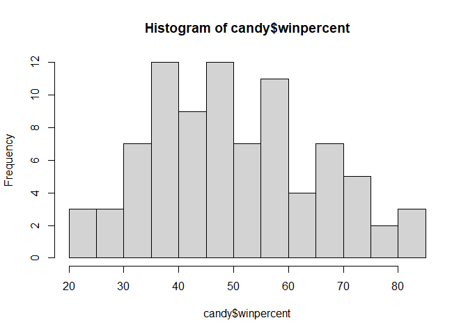
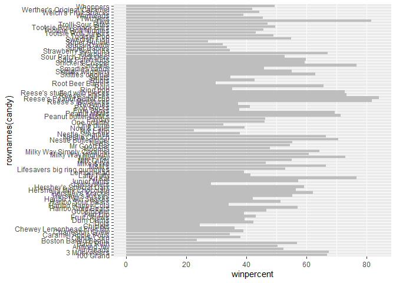
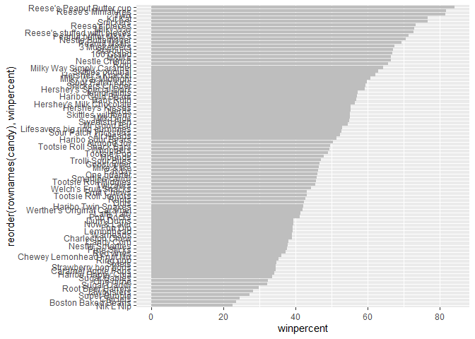
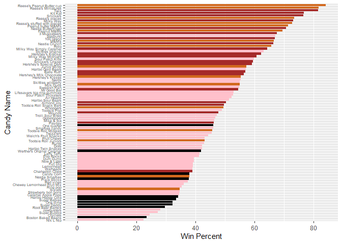
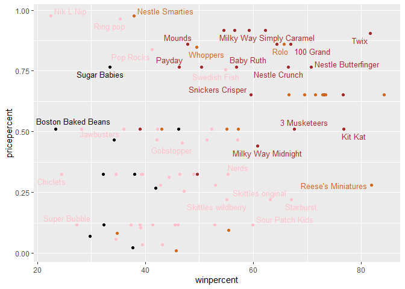
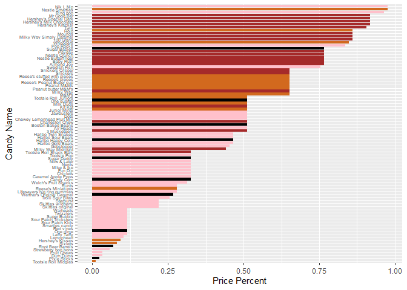
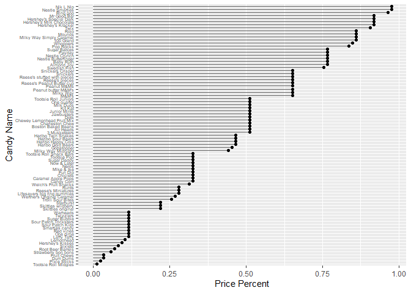
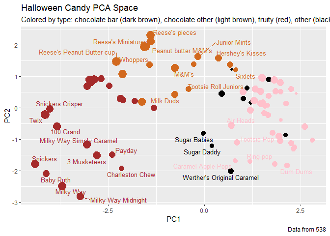

# Class09 Halloween project
Lance

https://bioboot.github.io/bimm143_F23/class-material/Halloween_candy.html

## 1. Importing candy data

First things first, let’s get the data from the FiveThirtyEight GitHub
repo. You can either read from the URL directely or download this
candy-data.csv file and place it in your project directory. Either way
we need to load it up with read.csv() and inspect the data to see
exactly what we’re dealing with.

First read the .csv data

``` r
candy_data <- "https://raw.githubusercontent.com/fivethirtyeight/data/master/candy-power-ranking/candy-data.csv"
```

``` r
candy = read.csv("https://raw.githubusercontent.com/fivethirtyeight/data/master/candy-power-ranking/candy-data.csv")
candy = read.csv("https://raw.githubusercontent.com/fivethirtyeight/data/master/candy-power-ranking/candy-data.csv", row.names=1)
head(candy)
```

                 chocolate fruity caramel peanutyalmondy nougat crispedricewafer
    100 Grand            1      0       1              0      0                1
    3 Musketeers         1      0       0              0      1                0
    One dime             0      0       0              0      0                0
    One quarter          0      0       0              0      0                0
    Air Heads            0      1       0              0      0                0
    Almond Joy           1      0       0              1      0                0
                 hard bar pluribus sugarpercent pricepercent winpercent
    100 Grand       0   1        0        0.732        0.860   66.97173
    3 Musketeers    0   1        0        0.604        0.511   67.60294
    One dime        0   0        0        0.011        0.116   32.26109
    One quarter     0   0        0        0.011        0.511   46.11650
    Air Heads       0   0        0        0.906        0.511   52.34146
    Almond Joy      0   1        0        0.465        0.767   50.34755

Could also use colnames(candy)\[1\] \<- “Name” to label column 1 as the
name but this seems to mess up later data

``` r
candy = read.csv("https://raw.githubusercontent.com/fivethirtyeight/data/master/candy-power-ranking/candy-data.csv", row.names=1)
head(candy)
```

                 chocolate fruity caramel peanutyalmondy nougat crispedricewafer
    100 Grand            1      0       1              0      0                1
    3 Musketeers         1      0       0              0      1                0
    One dime             0      0       0              0      0                0
    One quarter          0      0       0              0      0                0
    Air Heads            0      1       0              0      0                0
    Almond Joy           1      0       0              1      0                0
                 hard bar pluribus sugarpercent pricepercent winpercent
    100 Grand       0   1        0        0.732        0.860   66.97173
    3 Musketeers    0   1        0        0.604        0.511   67.60294
    One dime        0   0        0        0.011        0.116   32.26109
    One quarter     0   0        0        0.011        0.511   46.11650
    Air Heads       0   0        0        0.906        0.511   52.34146
    Almond Joy      0   1        0        0.465        0.767   50.34755

What is in the dataset?

The dataset includes all sorts of information about different kinds of
candy. For example, is a candy chocolaty? Does it have nougat? How does
its cost compare to other candies? How many people prefer one candy over
another?

According to 538 the columns in the dataset include:

    chocolate: Does it contain chocolate?
    fruity: Is it fruit flavored?
    caramel: Is there caramel in the candy?
    peanutyalmondy: Does it contain peanuts, peanut butter or almonds?
    nougat: Does it contain nougat?
    crispedricewafer: Does it contain crisped rice, wafers, or a cookie component?
    hard: Is it a hard candy?
    bar: Is it a candy bar?
    pluribus: Is it one of many candies in a bag or box?
    sugarpercent: The percentile of sugar it falls under within the data set.
    pricepercent: The unit price percentile compared to the rest of the set.
    winpercent: The overall win percentage according to 269,000 matchups (more on this in a moment).

    We will take a whirlwind tour of this dataset and in the process answer the questions highlighted in red throught this page that aim to guide your exploration process. We will then wrap up by trying Principal Component Analysis (PCA) on this dataset to get yet more experience with this important multivariate method. It will yield a kind of “Map of Hallowen Candy Space”. How cool is that! Let’s explore…

> Q1. How many different candy types are in this dataset?

``` r
ncol(candy)
```

    [1] 12

> A: 12 types of candy

> Q2. How many fruity candy types are in the dataset?

``` r
sum(candy$fruity)
```

    [1] 38

> A: 38 types of fruity candy.

``` r
#To change the chocolate zeros and 1s to logical values:
as.logical(candy$chocolate)
```

     [1]  TRUE  TRUE FALSE FALSE FALSE  TRUE  TRUE FALSE FALSE FALSE  TRUE FALSE
    [13] FALSE FALSE FALSE FALSE FALSE FALSE FALSE FALSE FALSE FALSE  TRUE  TRUE
    [25]  TRUE  TRUE FALSE  TRUE  TRUE FALSE FALSE FALSE  TRUE  TRUE FALSE  TRUE
    [37]  TRUE  TRUE  TRUE  TRUE  TRUE FALSE  TRUE  TRUE FALSE FALSE FALSE  TRUE
    [49] FALSE FALSE FALSE  TRUE  TRUE  TRUE  TRUE FALSE  TRUE FALSE FALSE  TRUE
    [61] FALSE FALSE  TRUE FALSE  TRUE  TRUE FALSE FALSE FALSE FALSE FALSE FALSE
    [73] FALSE FALSE  TRUE  TRUE  TRUE  TRUE FALSE  TRUE FALSE FALSE FALSE FALSE
    [85]  TRUE

``` r
#To list all of the chocolate candies:
candy[as.logical(candy$chocolate),]
```

                                chocolate fruity caramel peanutyalmondy nougat
    100 Grand                           1      0       1              0      0
    3 Musketeers                        1      0       0              0      1
    Almond Joy                          1      0       0              1      0
    Baby Ruth                           1      0       1              1      1
    Charleston Chew                     1      0       0              0      1
    Hershey's Kisses                    1      0       0              0      0
    Hershey's Krackel                   1      0       0              0      0
    Hershey's Milk Chocolate            1      0       0              0      0
    Hershey's Special Dark              1      0       0              0      0
    Junior Mints                        1      0       0              0      0
    Kit Kat                             1      0       0              0      0
    Peanut butter M&M's                 1      0       0              1      0
    M&M's                               1      0       0              0      0
    Milk Duds                           1      0       1              0      0
    Milky Way                           1      0       1              0      1
    Milky Way Midnight                  1      0       1              0      1
    Milky Way Simply Caramel            1      0       1              0      0
    Mounds                              1      0       0              0      0
    Mr Good Bar                         1      0       0              1      0
    Nestle Butterfinger                 1      0       0              1      0
    Nestle Crunch                       1      0       0              0      0
    Peanut M&Ms                         1      0       0              1      0
    Reese's Miniatures                  1      0       0              1      0
    Reese's Peanut Butter cup           1      0       0              1      0
    Reese's pieces                      1      0       0              1      0
    Reese's stuffed with pieces         1      0       0              1      0
    Rolo                                1      0       1              0      0
    Sixlets                             1      0       0              0      0
    Nestle Smarties                     1      0       0              0      0
    Snickers                            1      0       1              1      1
    Snickers Crisper                    1      0       1              1      0
    Tootsie Pop                         1      1       0              0      0
    Tootsie Roll Juniors                1      0       0              0      0
    Tootsie Roll Midgies                1      0       0              0      0
    Tootsie Roll Snack Bars             1      0       0              0      0
    Twix                                1      0       1              0      0
    Whoppers                            1      0       0              0      0
                                crispedricewafer hard bar pluribus sugarpercent
    100 Grand                                  1    0   1        0        0.732
    3 Musketeers                               0    0   1        0        0.604
    Almond Joy                                 0    0   1        0        0.465
    Baby Ruth                                  0    0   1        0        0.604
    Charleston Chew                            0    0   1        0        0.604
    Hershey's Kisses                           0    0   0        1        0.127
    Hershey's Krackel                          1    0   1        0        0.430
    Hershey's Milk Chocolate                   0    0   1        0        0.430
    Hershey's Special Dark                     0    0   1        0        0.430
    Junior Mints                               0    0   0        1        0.197
    Kit Kat                                    1    0   1        0        0.313
    Peanut butter M&M's                        0    0   0        1        0.825
    M&M's                                      0    0   0        1        0.825
    Milk Duds                                  0    0   0        1        0.302
    Milky Way                                  0    0   1        0        0.604
    Milky Way Midnight                         0    0   1        0        0.732
    Milky Way Simply Caramel                   0    0   1        0        0.965
    Mounds                                     0    0   1        0        0.313
    Mr Good Bar                                0    0   1        0        0.313
    Nestle Butterfinger                        0    0   1        0        0.604
    Nestle Crunch                              1    0   1        0        0.313
    Peanut M&Ms                                0    0   0        1        0.593
    Reese's Miniatures                         0    0   0        0        0.034
    Reese's Peanut Butter cup                  0    0   0        0        0.720
    Reese's pieces                             0    0   0        1        0.406
    Reese's stuffed with pieces                0    0   0        0        0.988
    Rolo                                       0    0   0        1        0.860
    Sixlets                                    0    0   0        1        0.220
    Nestle Smarties                            0    0   0        1        0.267
    Snickers                                   0    0   1        0        0.546
    Snickers Crisper                           1    0   1        0        0.604
    Tootsie Pop                                0    1   0        0        0.604
    Tootsie Roll Juniors                       0    0   0        0        0.313
    Tootsie Roll Midgies                       0    0   0        1        0.174
    Tootsie Roll Snack Bars                    0    0   1        0        0.465
    Twix                                       1    0   1        0        0.546
    Whoppers                                   1    0   0        1        0.872
                                pricepercent winpercent
    100 Grand                          0.860   66.97173
    3 Musketeers                       0.511   67.60294
    Almond Joy                         0.767   50.34755
    Baby Ruth                          0.767   56.91455
    Charleston Chew                    0.511   38.97504
    Hershey's Kisses                   0.093   55.37545
    Hershey's Krackel                  0.918   62.28448
    Hershey's Milk Chocolate           0.918   56.49050
    Hershey's Special Dark             0.918   59.23612
    Junior Mints                       0.511   57.21925
    Kit Kat                            0.511   76.76860
    Peanut butter M&M's                0.651   71.46505
    M&M's                              0.651   66.57458
    Milk Duds                          0.511   55.06407
    Milky Way                          0.651   73.09956
    Milky Way Midnight                 0.441   60.80070
    Milky Way Simply Caramel           0.860   64.35334
    Mounds                             0.860   47.82975
    Mr Good Bar                        0.918   54.52645
    Nestle Butterfinger                0.767   70.73564
    Nestle Crunch                      0.767   66.47068
    Peanut M&Ms                        0.651   69.48379
    Reese's Miniatures                 0.279   81.86626
    Reese's Peanut Butter cup          0.651   84.18029
    Reese's pieces                     0.651   73.43499
    Reese's stuffed with pieces        0.651   72.88790
    Rolo                               0.860   65.71629
    Sixlets                            0.081   34.72200
    Nestle Smarties                    0.976   37.88719
    Snickers                           0.651   76.67378
    Snickers Crisper                   0.651   59.52925
    Tootsie Pop                        0.325   48.98265
    Tootsie Roll Juniors               0.511   43.06890
    Tootsie Roll Midgies               0.011   45.73675
    Tootsie Roll Snack Bars            0.325   49.65350
    Twix                               0.906   81.64291
    Whoppers                           0.848   49.52411

## 2. What is your favorate candy?

One of the most interesting variables in the dataset is winpercent. For
a given candy this value is the percentage of people who prefer this
candy over another randomly chosen candy from the dataset (what 538 term
a matchup). Higher values indicate a more popular candy.

We can find the winpercent value for Twix by using its name to access
the corresponding row of the dataset. This is because the dataset has
each candy name as rownames (recall that we set this when we imported
the original CSV file). For example the code for Twix is:

``` r
candy["Twix", ]$winpercent
```

    [1] 81.64291

> Q3. What is your favorite candy in the dataset and what is it’s
> winpercent value?

``` r
candy["Reese's pieces", ]$winpercent
```

    [1] 73.43499

> A: “Reese’s pieces” winpercent is 73.44%

> Q4. What is the winpercent value for “Kit Kat”?

``` r
candy["Kit Kat", ]$winpercent
```

    [1] 76.7686

> A: 76.77%

> Q5. What is the winpercent value for “Tootsie Roll Snack Bars”?

``` r
candy["Tootsie Roll Snack Bars", ]$winpercent
```

    [1] 49.6535

> A: 49.65%

Side-note: the skimr::skim() function

There is a useful skim() function in the skimr package that can help
give you a quick overview of a given dataset. Let’s install this package
and try it on our candy data.

``` r
#install.packages("skimr") in console only - never in report
library("skimr")
skim(candy)
```

|                                                  |       |
|:-------------------------------------------------|:------|
| Name                                             | candy |
| Number of rows                                   | 85    |
| Number of columns                                | 12    |
| \_\_\_\_\_\_\_\_\_\_\_\_\_\_\_\_\_\_\_\_\_\_\_   |       |
| Column type frequency:                           |       |
| numeric                                          | 12    |
| \_\_\_\_\_\_\_\_\_\_\_\_\_\_\_\_\_\_\_\_\_\_\_\_ |       |
| Group variables                                  | None  |

Data summary

**Variable type: numeric**

| skim_variable    | n_missing | complete_rate |  mean |    sd |    p0 |   p25 |   p50 |   p75 |  p100 | hist  |
|:-----------------|----------:|--------------:|------:|------:|------:|------:|------:|------:|------:|:------|
| chocolate        |         0 |             1 |  0.44 |  0.50 |  0.00 |  0.00 |  0.00 |  1.00 |  1.00 | ▇▁▁▁▆ |
| fruity           |         0 |             1 |  0.45 |  0.50 |  0.00 |  0.00 |  0.00 |  1.00 |  1.00 | ▇▁▁▁▆ |
| caramel          |         0 |             1 |  0.16 |  0.37 |  0.00 |  0.00 |  0.00 |  0.00 |  1.00 | ▇▁▁▁▂ |
| peanutyalmondy   |         0 |             1 |  0.16 |  0.37 |  0.00 |  0.00 |  0.00 |  0.00 |  1.00 | ▇▁▁▁▂ |
| nougat           |         0 |             1 |  0.08 |  0.28 |  0.00 |  0.00 |  0.00 |  0.00 |  1.00 | ▇▁▁▁▁ |
| crispedricewafer |         0 |             1 |  0.08 |  0.28 |  0.00 |  0.00 |  0.00 |  0.00 |  1.00 | ▇▁▁▁▁ |
| hard             |         0 |             1 |  0.18 |  0.38 |  0.00 |  0.00 |  0.00 |  0.00 |  1.00 | ▇▁▁▁▂ |
| bar              |         0 |             1 |  0.25 |  0.43 |  0.00 |  0.00 |  0.00 |  0.00 |  1.00 | ▇▁▁▁▂ |
| pluribus         |         0 |             1 |  0.52 |  0.50 |  0.00 |  0.00 |  1.00 |  1.00 |  1.00 | ▇▁▁▁▇ |
| sugarpercent     |         0 |             1 |  0.48 |  0.28 |  0.01 |  0.22 |  0.47 |  0.73 |  0.99 | ▇▇▇▇▆ |
| pricepercent     |         0 |             1 |  0.47 |  0.29 |  0.01 |  0.26 |  0.47 |  0.65 |  0.98 | ▇▇▇▇▆ |
| winpercent       |         0 |             1 | 50.32 | 14.71 | 22.45 | 39.14 | 47.83 | 59.86 | 84.18 | ▃▇▆▅▂ |

From your use of the skim() function use the output to answer the
following:

> Q6. Is there any variable/column that looks to be on a different scale
> to the majority of the other columns in the dataset?

> A: the winpercent row

> Q7. What do you think a zero and one represent for the
> candy\$chocolate column?

> A: True or False that the candy is chocolate-based

A good place to start any exploratory analysis is with a histogram. You
can do this most easily with the base R function hist(). Alternatively,
you can use ggplot() with geom_hist(). Either works well in this case
and (as always) its your choice.

> Q8. Plot a histogram of winpercent values A:

``` r
#using base R:
hist(candy$winpercent, breaks=20)


#but use of ggplot will be better as charts get more complex:
library(ggplot2)
```



``` r
ggplot(candy)+
  aes(winpercent)+
  geom_histogram(binwidth = 10)
```


> Q9. Is the distribution of winpercent values symmetrical? A: No

> Q10. Is the center of the distribution above or below 50%?

``` r
median(candy$winpercent)
```

    [1] 47.82975

> A: Below

> Q11:On average is chocolate candy higher or lower ranked than fruit
> candy?

first name/extract all chocolate/fruit candy rows (use as.logical). DOnt
want the whole value just winpercent

``` r
#want to turn candy$chocolate into as.logical:
as.logical(candy$chocolate)
```

     [1]  TRUE  TRUE FALSE FALSE FALSE  TRUE  TRUE FALSE FALSE FALSE  TRUE FALSE
    [13] FALSE FALSE FALSE FALSE FALSE FALSE FALSE FALSE FALSE FALSE  TRUE  TRUE
    [25]  TRUE  TRUE FALSE  TRUE  TRUE FALSE FALSE FALSE  TRUE  TRUE FALSE  TRUE
    [37]  TRUE  TRUE  TRUE  TRUE  TRUE FALSE  TRUE  TRUE FALSE FALSE FALSE  TRUE
    [49] FALSE FALSE FALSE  TRUE  TRUE  TRUE  TRUE FALSE  TRUE FALSE FALSE  TRUE
    [61] FALSE FALSE  TRUE FALSE  TRUE  TRUE FALSE FALSE FALSE FALSE FALSE FALSE
    [73] FALSE FALSE  TRUE  TRUE  TRUE  TRUE FALSE  TRUE FALSE FALSE FALSE FALSE
    [85]  TRUE

``` r
#make vector of it
choc.ins <- as.logical(candy$chocolate)

#then use square brackets to locate true/false
candy[choc.ins,]
```

                                chocolate fruity caramel peanutyalmondy nougat
    100 Grand                           1      0       1              0      0
    3 Musketeers                        1      0       0              0      1
    Almond Joy                          1      0       0              1      0
    Baby Ruth                           1      0       1              1      1
    Charleston Chew                     1      0       0              0      1
    Hershey's Kisses                    1      0       0              0      0
    Hershey's Krackel                   1      0       0              0      0
    Hershey's Milk Chocolate            1      0       0              0      0
    Hershey's Special Dark              1      0       0              0      0
    Junior Mints                        1      0       0              0      0
    Kit Kat                             1      0       0              0      0
    Peanut butter M&M's                 1      0       0              1      0
    M&M's                               1      0       0              0      0
    Milk Duds                           1      0       1              0      0
    Milky Way                           1      0       1              0      1
    Milky Way Midnight                  1      0       1              0      1
    Milky Way Simply Caramel            1      0       1              0      0
    Mounds                              1      0       0              0      0
    Mr Good Bar                         1      0       0              1      0
    Nestle Butterfinger                 1      0       0              1      0
    Nestle Crunch                       1      0       0              0      0
    Peanut M&Ms                         1      0       0              1      0
    Reese's Miniatures                  1      0       0              1      0
    Reese's Peanut Butter cup           1      0       0              1      0
    Reese's pieces                      1      0       0              1      0
    Reese's stuffed with pieces         1      0       0              1      0
    Rolo                                1      0       1              0      0
    Sixlets                             1      0       0              0      0
    Nestle Smarties                     1      0       0              0      0
    Snickers                            1      0       1              1      1
    Snickers Crisper                    1      0       1              1      0
    Tootsie Pop                         1      1       0              0      0
    Tootsie Roll Juniors                1      0       0              0      0
    Tootsie Roll Midgies                1      0       0              0      0
    Tootsie Roll Snack Bars             1      0       0              0      0
    Twix                                1      0       1              0      0
    Whoppers                            1      0       0              0      0
                                crispedricewafer hard bar pluribus sugarpercent
    100 Grand                                  1    0   1        0        0.732
    3 Musketeers                               0    0   1        0        0.604
    Almond Joy                                 0    0   1        0        0.465
    Baby Ruth                                  0    0   1        0        0.604
    Charleston Chew                            0    0   1        0        0.604
    Hershey's Kisses                           0    0   0        1        0.127
    Hershey's Krackel                          1    0   1        0        0.430
    Hershey's Milk Chocolate                   0    0   1        0        0.430
    Hershey's Special Dark                     0    0   1        0        0.430
    Junior Mints                               0    0   0        1        0.197
    Kit Kat                                    1    0   1        0        0.313
    Peanut butter M&M's                        0    0   0        1        0.825
    M&M's                                      0    0   0        1        0.825
    Milk Duds                                  0    0   0        1        0.302
    Milky Way                                  0    0   1        0        0.604
    Milky Way Midnight                         0    0   1        0        0.732
    Milky Way Simply Caramel                   0    0   1        0        0.965
    Mounds                                     0    0   1        0        0.313
    Mr Good Bar                                0    0   1        0        0.313
    Nestle Butterfinger                        0    0   1        0        0.604
    Nestle Crunch                              1    0   1        0        0.313
    Peanut M&Ms                                0    0   0        1        0.593
    Reese's Miniatures                         0    0   0        0        0.034
    Reese's Peanut Butter cup                  0    0   0        0        0.720
    Reese's pieces                             0    0   0        1        0.406
    Reese's stuffed with pieces                0    0   0        0        0.988
    Rolo                                       0    0   0        1        0.860
    Sixlets                                    0    0   0        1        0.220
    Nestle Smarties                            0    0   0        1        0.267
    Snickers                                   0    0   1        0        0.546
    Snickers Crisper                           1    0   1        0        0.604
    Tootsie Pop                                0    1   0        0        0.604
    Tootsie Roll Juniors                       0    0   0        0        0.313
    Tootsie Roll Midgies                       0    0   0        1        0.174
    Tootsie Roll Snack Bars                    0    0   1        0        0.465
    Twix                                       1    0   1        0        0.546
    Whoppers                                   1    0   0        1        0.872
                                pricepercent winpercent
    100 Grand                          0.860   66.97173
    3 Musketeers                       0.511   67.60294
    Almond Joy                         0.767   50.34755
    Baby Ruth                          0.767   56.91455
    Charleston Chew                    0.511   38.97504
    Hershey's Kisses                   0.093   55.37545
    Hershey's Krackel                  0.918   62.28448
    Hershey's Milk Chocolate           0.918   56.49050
    Hershey's Special Dark             0.918   59.23612
    Junior Mints                       0.511   57.21925
    Kit Kat                            0.511   76.76860
    Peanut butter M&M's                0.651   71.46505
    M&M's                              0.651   66.57458
    Milk Duds                          0.511   55.06407
    Milky Way                          0.651   73.09956
    Milky Way Midnight                 0.441   60.80070
    Milky Way Simply Caramel           0.860   64.35334
    Mounds                             0.860   47.82975
    Mr Good Bar                        0.918   54.52645
    Nestle Butterfinger                0.767   70.73564
    Nestle Crunch                      0.767   66.47068
    Peanut M&Ms                        0.651   69.48379
    Reese's Miniatures                 0.279   81.86626
    Reese's Peanut Butter cup          0.651   84.18029
    Reese's pieces                     0.651   73.43499
    Reese's stuffed with pieces        0.651   72.88790
    Rolo                               0.860   65.71629
    Sixlets                            0.081   34.72200
    Nestle Smarties                    0.976   37.88719
    Snickers                           0.651   76.67378
    Snickers Crisper                   0.651   59.52925
    Tootsie Pop                        0.325   48.98265
    Tootsie Roll Juniors               0.511   43.06890
    Tootsie Roll Midgies               0.011   45.73675
    Tootsie Roll Snack Bars            0.325   49.65350
    Twix                               0.906   81.64291
    Whoppers                           0.848   49.52411

``` r
#to find just the winpercent of above
candy[choc.ins,"winpercent"]
```

     [1] 66.97173 67.60294 50.34755 56.91455 38.97504 55.37545 62.28448 56.49050
     [9] 59.23612 57.21925 76.76860 71.46505 66.57458 55.06407 73.09956 60.80070
    [17] 64.35334 47.82975 54.52645 70.73564 66.47068 69.48379 81.86626 84.18029
    [25] 73.43499 72.88790 65.71629 34.72200 37.88719 76.67378 59.52925 48.98265
    [33] 43.06890 45.73675 49.65350 81.64291 49.52411

``` r
#then assign the winpercent of chocolate to choc.win
choc.win <- candy[choc.ins,"winpercent"]

#Then can find the average 
mean(choc.win)
```

    [1] 60.92153

``` r
#Then name the mean choc.mean
choc.mean <- mean(choc.win)
```

then can repeat process for fruity candy and then compare them

``` r
#want to turn candy$fruity into as.logical:
as.logical(candy$fruity)
```

     [1] FALSE FALSE FALSE FALSE  TRUE FALSE FALSE FALSE FALSE  TRUE FALSE  TRUE
    [13]  TRUE  TRUE  TRUE  TRUE  TRUE  TRUE  TRUE FALSE  TRUE  TRUE FALSE FALSE
    [25] FALSE FALSE  TRUE FALSE FALSE  TRUE  TRUE  TRUE FALSE FALSE  TRUE FALSE
    [37] FALSE FALSE FALSE FALSE FALSE  TRUE FALSE FALSE  TRUE  TRUE FALSE FALSE
    [49] FALSE  TRUE  TRUE FALSE FALSE FALSE FALSE  TRUE FALSE FALSE  TRUE FALSE
    [61]  TRUE  TRUE FALSE  TRUE FALSE FALSE  TRUE  TRUE  TRUE  TRUE FALSE FALSE
    [73]  TRUE  TRUE  TRUE FALSE FALSE FALSE  TRUE FALSE  TRUE  TRUE  TRUE FALSE
    [85] FALSE

``` r
#make vector of it
fruity.ins <- as.logical(candy$fruity)

#then use square brackets to locate true/false
candy[fruity.ins,]
```

                                chocolate fruity caramel peanutyalmondy nougat
    Air Heads                           0      1       0              0      0
    Caramel Apple Pops                  0      1       1              0      0
    Chewey Lemonhead Fruit Mix          0      1       0              0      0
    Chiclets                            0      1       0              0      0
    Dots                                0      1       0              0      0
    Dum Dums                            0      1       0              0      0
    Fruit Chews                         0      1       0              0      0
    Fun Dip                             0      1       0              0      0
    Gobstopper                          0      1       0              0      0
    Haribo Gold Bears                   0      1       0              0      0
    Haribo Sour Bears                   0      1       0              0      0
    Haribo Twin Snakes                  0      1       0              0      0
    Jawbusters                          0      1       0              0      0
    Laffy Taffy                         0      1       0              0      0
    Lemonhead                           0      1       0              0      0
    Lifesavers big ring gummies         0      1       0              0      0
    Mike & Ike                          0      1       0              0      0
    Nerds                               0      1       0              0      0
    Nik L Nip                           0      1       0              0      0
    Now & Later                         0      1       0              0      0
    Pop Rocks                           0      1       0              0      0
    Red vines                           0      1       0              0      0
    Ring pop                            0      1       0              0      0
    Runts                               0      1       0              0      0
    Skittles original                   0      1       0              0      0
    Skittles wildberry                  0      1       0              0      0
    Smarties candy                      0      1       0              0      0
    Sour Patch Kids                     0      1       0              0      0
    Sour Patch Tricksters               0      1       0              0      0
    Starburst                           0      1       0              0      0
    Strawberry bon bons                 0      1       0              0      0
    Super Bubble                        0      1       0              0      0
    Swedish Fish                        0      1       0              0      0
    Tootsie Pop                         1      1       0              0      0
    Trolli Sour Bites                   0      1       0              0      0
    Twizzlers                           0      1       0              0      0
    Warheads                            0      1       0              0      0
    Welch's Fruit Snacks                0      1       0              0      0
                                crispedricewafer hard bar pluribus sugarpercent
    Air Heads                                  0    0   0        0        0.906
    Caramel Apple Pops                         0    0   0        0        0.604
    Chewey Lemonhead Fruit Mix                 0    0   0        1        0.732
    Chiclets                                   0    0   0        1        0.046
    Dots                                       0    0   0        1        0.732
    Dum Dums                                   0    1   0        0        0.732
    Fruit Chews                                0    0   0        1        0.127
    Fun Dip                                    0    1   0        0        0.732
    Gobstopper                                 0    1   0        1        0.906
    Haribo Gold Bears                          0    0   0        1        0.465
    Haribo Sour Bears                          0    0   0        1        0.465
    Haribo Twin Snakes                         0    0   0        1        0.465
    Jawbusters                                 0    1   0        1        0.093
    Laffy Taffy                                0    0   0        0        0.220
    Lemonhead                                  0    1   0        0        0.046
    Lifesavers big ring gummies                0    0   0        0        0.267
    Mike & Ike                                 0    0   0        1        0.872
    Nerds                                      0    1   0        1        0.848
    Nik L Nip                                  0    0   0        1        0.197
    Now & Later                                0    0   0        1        0.220
    Pop Rocks                                  0    1   0        1        0.604
    Red vines                                  0    0   0        1        0.581
    Ring pop                                   0    1   0        0        0.732
    Runts                                      0    1   0        1        0.872
    Skittles original                          0    0   0        1        0.941
    Skittles wildberry                         0    0   0        1        0.941
    Smarties candy                             0    1   0        1        0.267
    Sour Patch Kids                            0    0   0        1        0.069
    Sour Patch Tricksters                      0    0   0        1        0.069
    Starburst                                  0    0   0        1        0.151
    Strawberry bon bons                        0    1   0        1        0.569
    Super Bubble                               0    0   0        0        0.162
    Swedish Fish                               0    0   0        1        0.604
    Tootsie Pop                                0    1   0        0        0.604
    Trolli Sour Bites                          0    0   0        1        0.313
    Twizzlers                                  0    0   0        0        0.220
    Warheads                                   0    1   0        0        0.093
    Welch's Fruit Snacks                       0    0   0        1        0.313
                                pricepercent winpercent
    Air Heads                          0.511   52.34146
    Caramel Apple Pops                 0.325   34.51768
    Chewey Lemonhead Fruit Mix         0.511   36.01763
    Chiclets                           0.325   24.52499
    Dots                               0.511   42.27208
    Dum Dums                           0.034   39.46056
    Fruit Chews                        0.034   43.08892
    Fun Dip                            0.325   39.18550
    Gobstopper                         0.453   46.78335
    Haribo Gold Bears                  0.465   57.11974
    Haribo Sour Bears                  0.465   51.41243
    Haribo Twin Snakes                 0.465   42.17877
    Jawbusters                         0.511   28.12744
    Laffy Taffy                        0.116   41.38956
    Lemonhead                          0.104   39.14106
    Lifesavers big ring gummies        0.279   52.91139
    Mike & Ike                         0.325   46.41172
    Nerds                              0.325   55.35405
    Nik L Nip                          0.976   22.44534
    Now & Later                        0.325   39.44680
    Pop Rocks                          0.837   41.26551
    Red vines                          0.116   37.34852
    Ring pop                           0.965   35.29076
    Runts                              0.279   42.84914
    Skittles original                  0.220   63.08514
    Skittles wildberry                 0.220   55.10370
    Smarties candy                     0.116   45.99583
    Sour Patch Kids                    0.116   59.86400
    Sour Patch Tricksters              0.116   52.82595
    Starburst                          0.220   67.03763
    Strawberry bon bons                0.058   34.57899
    Super Bubble                       0.116   27.30386
    Swedish Fish                       0.755   54.86111
    Tootsie Pop                        0.325   48.98265
    Trolli Sour Bites                  0.255   47.17323
    Twizzlers                          0.116   45.46628
    Warheads                           0.116   39.01190
    Welch's Fruit Snacks               0.313   44.37552

``` r
#to find just the winpercent of above
candy[fruity.ins,"winpercent"]
```

     [1] 52.34146 34.51768 36.01763 24.52499 42.27208 39.46056 43.08892 39.18550
     [9] 46.78335 57.11974 51.41243 42.17877 28.12744 41.38956 39.14106 52.91139
    [17] 46.41172 55.35405 22.44534 39.44680 41.26551 37.34852 35.29076 42.84914
    [25] 63.08514 55.10370 45.99583 59.86400 52.82595 67.03763 34.57899 27.30386
    [33] 54.86111 48.98265 47.17323 45.46628 39.01190 44.37552

``` r
#then assign the winpercent of chocolate to choc.win
fruity.win <- candy[fruity.ins,"winpercent"]

#Then can find the average 
mean(fruity.win)
```

    [1] 44.11974

``` r
#Then name the mean fruity.mean
fruity.mean <- mean(fruity.win)
```

> Q11 A:Chocolate wins %60 vs. %44

> Q12: Q12. Is this difference statistically significant?

Hint: The chocolate, fruity, nougat etc. columns indicate if a given
candy has this feature (i.e. one if it has nougart, zero if it does not
etc.). We can turn these into logical (a.k.a. TRUE/FALSE) values with
the as.logical() function. We can then use this logical vector to access
the coresponding candy rows (those with TRUE values). For example to get
the winpercent values for all nougat contaning candy we can use the
code: candy$winpercent[as.logical(candy$nougat)\]. In addation the
functions mean() and t.test() should help you answer the last two
questions here.

use t-test:

``` r
t.test(choc.win, fruity.win)
```


        Welch Two Sample t-test

    data:  choc.win and fruity.win
    t = 6.2582, df = 68.882, p-value = 2.871e-08
    alternative hypothesis: true difference in means is not equal to 0
    95 percent confidence interval:
     11.44563 22.15795
    sample estimates:
    mean of x mean of y 
     60.92153  44.11974 

> A: Yes (p-value = 2.871e-08)

## 3. Overall Candy Rankings

Let’s use the base R order() function together with head() to sort the
whole dataset by winpercent. Or if you have been getting into the
tidyverse and the dplyr package you can use the arrange() function
together with head() to do the same thing and answer the following
questions:

> Q13. What are the five least liked candy types in this set?

Method that works if 1st column is labeled as name(won’t work otherwise)

``` r
# Use the order() function to get the sorted order
sorted_order <- order(candy$winpercent)

# Extract the names corresponding to the sorted order
sorted_names <- candy$Name[sorted_order]

# Display the sorted names
print(sorted_names[1:5])
```

    NULL

> A:“Nik L Nip” “Boston Baked Beans” “Chiclets” “Super Bubble”
> “Jawbusters”

> Q14. What are the top 5 all time favorite candy types out of this set?

``` r
print(sorted_names[81:85])
```

    NULL

> A: “Snickers” “Kit Kat” “Twix” “Reese’s Miniatures” “Reese’s Peanut
> Butter cup”

Alternative method Hint: Using base R we could use
head(candy\[order(candy\$winpercent),\], n=5), whilst using dplyr we
have: candy %\>% arrange(winpercent) %\>% head(5). Which apprach do you
prefer and why?

``` r
head(candy[order(candy$winpercent),], n=5)
```

                       chocolate fruity caramel peanutyalmondy nougat
    Nik L Nip                  0      1       0              0      0
    Boston Baked Beans         0      0       0              1      0
    Chiclets                   0      1       0              0      0
    Super Bubble               0      1       0              0      0
    Jawbusters                 0      1       0              0      0
                       crispedricewafer hard bar pluribus sugarpercent pricepercent
    Nik L Nip                         0    0   0        1        0.197        0.976
    Boston Baked Beans                0    0   0        1        0.313        0.511
    Chiclets                          0    0   0        1        0.046        0.325
    Super Bubble                      0    0   0        0        0.162        0.116
    Jawbusters                        0    1   0        1        0.093        0.511
                       winpercent
    Nik L Nip            22.44534
    Boston Baked Beans   23.41782
    Chiclets             24.52499
    Super Bubble         27.30386
    Jawbusters           28.12744

Using dplyr:

``` r
library(dplyr)
```


    Attaching package: 'dplyr'

    The following objects are masked from 'package:stats':

        filter, lag

    The following objects are masked from 'package:base':

        intersect, setdiff, setequal, union

``` r
candy %>% arrange(winpercent) %>% head(5)
```

                       chocolate fruity caramel peanutyalmondy nougat
    Nik L Nip                  0      1       0              0      0
    Boston Baked Beans         0      0       0              1      0
    Chiclets                   0      1       0              0      0
    Super Bubble               0      1       0              0      0
    Jawbusters                 0      1       0              0      0
                       crispedricewafer hard bar pluribus sugarpercent pricepercent
    Nik L Nip                         0    0   0        1        0.197        0.976
    Boston Baked Beans                0    0   0        1        0.313        0.511
    Chiclets                          0    0   0        1        0.046        0.325
    Super Bubble                      0    0   0        0        0.162        0.116
    Jawbusters                        0    1   0        1        0.093        0.511
                       winpercent
    Nik L Nip            22.44534
    Boston Baked Beans   23.41782
    Chiclets             24.52499
    Super Bubble         27.30386
    Jawbusters           28.12744

dplyr is better because it tells the rank of the candies instead of
their number in the chart (if first row is named). Dplyr may also be
better because it is more intuitive.

To examine more of the dataset in this vain we can make a barplot to
visualize the overall rankings. We will use an iterative approach to
building a useful visulization by getting a rough starting plot and then
refining and adding useful details in a stepwise process.

> Q15. Make a first barplot of candy ranking based on winpercent values.

``` r
library(ggplot2)
ggplot(candy)+
aes(winpercent, rownames(candy))+
geom_col(fill="gray")
```



> Q16. This is quite ugly, use the reorder() function to get the bars
> sorted by winpercent? HINT: You can use aes(winpercent,
> reorder(rownames(candy),winpercent)) to improve your plot.

``` r
#reordered
ggplot(candy)+
aes(winpercent, reorder(rownames(candy), winpercent))+
geom_col(fill="gray")
```



Time to add some useful color

Let’s setup a color vector (that signifies candy type) that we can then
use for some future plots. We start by making a vector of all black
values (one for each candy). Then we overwrite chocolate (for chocolate
candy), brown (for candy bars) and red (for fruity candy) values.

``` r
my_cols=rep("black", nrow(candy))
my_cols[as.logical(candy$chocolate)] = "chocolate"
my_cols[as.logical(candy$bar)] = "brown"
my_cols[as.logical(candy$fruity)] = "pink"
```

Now let’s try our barplot with these colors. Note that we use
fill=my_cols for geom_col(). Experement to see what happens if you use
col=mycols.

``` r
ggplot(candy) + 
  aes(winpercent, reorder(rownames(candy),winpercent)) +
  geom_col(fill=my_cols) +
  labs(x = "Win Percent", y = "Candy Name")+
   theme(axis.text.y = element_text(size = 5)) 
```



Now, for the first time, using this plot we can answer questions like:
\>Q17. What is the worst ranked chocolate candy? \>A: Sixlets

> Q18. What is the best ranked fruity candy? A: Starburst

## 4. Taking a look at pricepercent

What about value for money? What is the the best candy for the least
money? One way to get at this would be to make a plot of winpercent vs
the pricepercent variable. The pricepercent variable records the
percentile rank of the candy’s price against all the other candies in
the dataset. Lower vales are less expensive and high values more
expensive.

To this plot we will add text labels so we can more easily identify a
given candy. There is a regular geom_label() that comes with ggplot2.
However, as there are quite a few candys in our dataset lots of these
labels will be overlapping and hard to read. To help with this we can
use the geom_text_repel() function from the ggrepel package.

``` r
library(ggrepel)

# How about a plot of price vs win
ggplot(candy) +
  aes(winpercent, pricepercent, label=rownames(candy)) +
  geom_point(col=my_cols) + 
  geom_text_repel(col=my_cols, size=3.3, max.overlaps = 5)
```

    Warning: ggrepel: 54 unlabeled data points (too many overlaps). Consider
    increasing max.overlaps



> Q19. Which candy type is the highest ranked in terms of winpercent for
> the least money - i.e. offers the most bang for your buck? A:Reese’s
> miniatures

> Q20. What are the top 5 most expensive candy types in the dataset and
> of these which is the least popular? Hint: To see which candy is the
> most expensive (and which is the least expensive) we can order() the
> dataset by pricepercent.

``` r
ord <- order(candy$pricepercent, decreasing = TRUE)
head( candy[ord,c(11,12)], n=5 )
```

                             pricepercent winpercent
    Nik L Nip                       0.976   22.44534
    Nestle Smarties                 0.976   37.88719
    Ring pop                        0.965   35.29076
    Hershey's Krackel               0.918   62.28448
    Hershey's Milk Chocolate        0.918   56.49050

> A: Nik L Nip is the least popular but has the highest pricepercent

> Q21. Make a barplot again with geom_col() this time using pricepercent
> and then improve this step by step, first ordering the x-axis by value
> and finally making a so called “dot chat” or “lollipop” chart by
> swapping geom_col() for geom_point() + geom_segment().

``` r
ggplot(candy) + 
  aes(pricepercent, reorder(rownames(candy),pricepercent)) +
  geom_col(fill=my_cols) +
  labs(x = "Price Percent", y = "Candy Name")+
   theme(axis.text.y = element_text(size = 5)) 
```



``` r
# Make a lollipop chart of pricepercent
ggplot(candy) +
  aes(pricepercent, reorder(rownames(candy), pricepercent)) +
  geom_segment(aes(yend = reorder(rownames(candy), pricepercent), 
                   xend = 0), col="gray40") +
    geom_point()+
  labs(x = "Price Percent", y = "Candy Name")+
   theme(axis.text.y = element_text(size = 5))
```



## 5 Exploring the correlation structure

Now that we’ve explored the dataset a little, we’ll see how the
variables interact with one another. We’ll use correlation and view the
results with the corrplot package to plot a correlation matrix.

``` r
library(corrplot)
```

    corrplot 0.92 loaded

``` r
cij <- cor(candy)
corrplot(cij)
```


> Q22. Examining this plot what two variables are anti-correlated
> (i.e. have minus values)? A:Fruity and chocolate

> Q23. Similarly, what two variables are most positively correlated?
> A:Winpercent and chocolate

## 6. Principal Component Analysis

Let’s apply PCA using the prcom() function to our candy dataset
remembering to set the scale=TRUE argument.

    Side-note: Feel free to examine what happens if you leave this argument out (i.e. use the default scale=FALSE). Then examine the summary(pca) and pca$rotation[,1] component and see that it is dominated by winpercent (which is after all measured on a very different scale than the other variables).

``` r
pca <- prcomp(candy, scale=TRUE)
summary(pca)
```

    Importance of components:
                              PC1    PC2    PC3     PC4    PC5     PC6     PC7
    Standard deviation     2.0788 1.1378 1.1092 1.07533 0.9518 0.81923 0.81530
    Proportion of Variance 0.3601 0.1079 0.1025 0.09636 0.0755 0.05593 0.05539
    Cumulative Proportion  0.3601 0.4680 0.5705 0.66688 0.7424 0.79830 0.85369
                               PC8     PC9    PC10    PC11    PC12
    Standard deviation     0.74530 0.67824 0.62349 0.43974 0.39760
    Proportion of Variance 0.04629 0.03833 0.03239 0.01611 0.01317
    Cumulative Proportion  0.89998 0.93832 0.97071 0.98683 1.00000

Side-note: Feel free to examine what happens if you leave this argument
out (i.e. use the default scale=FALSE). Then examine the summary(pca)
and pca\$rotation\[,1\] component and see that it is dominated by
winpercent (which is after all measured on a very different scale than
the other variables).

Now we can plot our main PCA score plot of PC1 vs PC2.

``` r
plot(pca$x[,1:2])
```


We can change the plotting character and add some color:

``` r
plot(pca$x[,1:2], col=my_cols, pch=16)
```


We can make a much nicer plot with the ggplot2 package but it is
important to note that ggplot works best when you supply an input
data.frame that includes a separate column for each of the aesthetics
you would like displayed in your final plot. To accomplish this we make
a new data.frame here that contains our PCA results with all the rest of
our candy data. We will then use this for making plots below

``` r
# Make a new data-frame with our PCA results and candy data:
my_data <- cbind(candy, pca$x[,1:3])
```

``` r
p <- ggplot(my_data) + 
        aes(x=PC1, y=PC2, 
            size=winpercent/100,  
            text=rownames(my_data),
            label=rownames(my_data)) +
        geom_point(col=my_cols)

p
```


Again we can use the ggrepel package and the function
ggrepel::geom_text_repel() to label up the plot with non overlapping
candy names like. We will also add a title and subtitle like so:

``` r
library(ggrepel)

p + geom_text_repel(size=3.3, col=my_cols, max.overlaps = 5)  + 
  theme(legend.position = "none") +
  labs(title="Halloween Candy PCA Space",
       subtitle="Colored by type: chocolate bar (dark brown), chocolate other (light brown), fruity (red), other (black)",
       caption="Data from 538")
```

    Warning: ggrepel: 55 unlabeled data points (too many overlaps). Consider
    increasing max.overlaps



more candy labels you can change the max.overlaps value to allow more
overlapping labels or pass the ggplot object p to plotly like so to
generate an interactive plot that you can mouse over to see labels:

``` r
#> install.packages("plotly") (in console window)
library(plotly)
```

    Warning: package 'plotly' was built under R version 4.3.2


    Attaching package: 'plotly'

    The following object is masked from 'package:ggplot2':

        last_plot

    The following object is masked from 'package:stats':

        filter

    The following object is masked from 'package:graphics':

        layout

``` r
#ggplotly(p)
```

Let’s finish by taking a quick look at PCA our loadings. Do these make
sense to you? Notice the opposite effects of chocolate and fruity and
the similar effects of chocolate and bar (i.e. we already know they are
correlated).

``` r
par(mar=c(8,4,2,2))
barplot(pca$rotation[,1], las=2, ylab="PC1 Contribution")
```


> Q24. What original variables are picked up strongly by PC1 in the
> positive direction? Do these make sense to you? A: Fuity, hard, and
> pluribus. These are the values driving the most variation in PC1.
